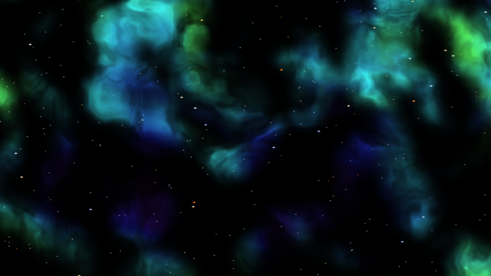

# Procedurally Generated dNebulae

Code based off of the article by Takumi McAllister [here](http://www.codetako.com/Tutorial/Procedural-Nebulae/). There were some missing implementation details in the article and was able to contact him via email for the missing portions.

Along with his originall code, coverted to C# Unity MonoBehaviours (see [Nebula Noise](./Assets/Nebula%20Noise/)), is an implementation utilizing some modifications of my own, including colorization based on [emission ranges of real nebulae](https://clarkvision.com/articles/color.of.nebulae.and.interstellar.dust/).

